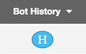

# AD - Delete User (Task)
## User Management

### Purpose 
				Delete user from Active Directory.

#### How it Work 

- Usage
	- User can edit parameters and save it as a New BOT.
	- User can edit parameters and update Existing BOT.
	- In both case after save either new data file will be committed in Git or existing code will be updated based on choice.
  
- Parameters

Name    |    Description           |      Values        
---------------|--------------------------|--------------------
 First Name    | First Name               |    Vimal             
 Last Name     | Last Name                |    Mishra              
	
- Result
	- After bot execution successfully user will be deleted from Active Directory.

### Logs

### Source Code
   [Git Link]  (https://github.com/RLIndia/botsfactory/tree/master/Code/Task_BOTs/cookbooks/AD_UserDeletion)
